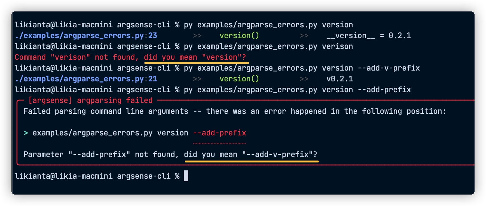
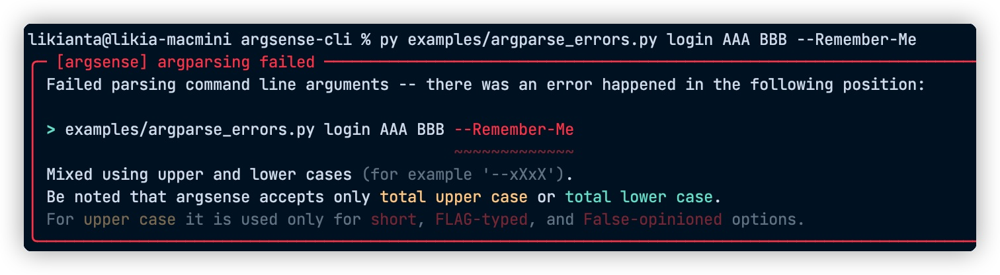
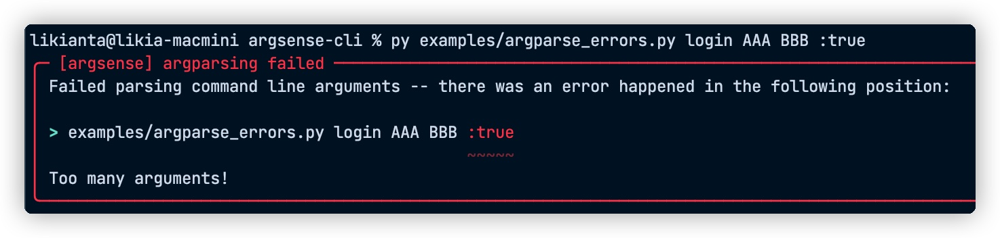

# 更新日志

### 0.6.0 (wip)

- 新增 group 特性 (详见说明文档).
- 更好地解析 docstring.

### 0.5.0 (2022-11-20)

- 支持 `*args` 和 `**kwargs` 传参.
- 更好的单元测试.

### 0.4.3 (2022-11-12)

- 样式调整.
- 其他优化.

### 0.4.2 (2022-08-30)

修复 python 3.8 适配问题.

### 0.4.1 (2022-07-26)

修复类型检查错误.

### 0.4.0 (2022-07-24)

允许 "匿名" 的方式传入 option 参数.

```sh
# befoer
python3 login.py username --password 123456

# after
python3 login.py username 123456
```

---

### 0.3.1

修复了一些细节.

### 0.3.0

优化了文字颜色, 使文字在不同终端主题下尽量保持一致的感觉, 提升美观性.

---

### 0.2.2

加强参数类型转换.

### 0.2.1

"did-you-mean" 功能:



### 0.2.0

完善命令行传参错误的处理方式.

现在, 当发生报错时, 将提供参数位置, 报错原因等信息, 如下图所示:





---

### 0.1.2

调整了输出样式.

一些值得注意的细节:

- 解决了传参问题, 发现之前的版本几乎不可能在正常传参的情况下工作.
- 字段宽度对齐策略有所放松. 该调整让实际效果更美观了.
- 灵活的标题头样式, 在考虑到实际情况 (比如想要复制标题作为下次的命令时), 现在更加切合实际需求了.
- 首页的文档有了最新的截图.

### 0.1.1

空参传递的时候, 回调到 help 命令上.

### 0.1.0

argsense 的基本功能验证通过.

重要的, help 和 helpx 命令及输出效果都符合预期.
