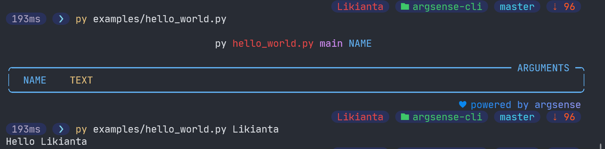
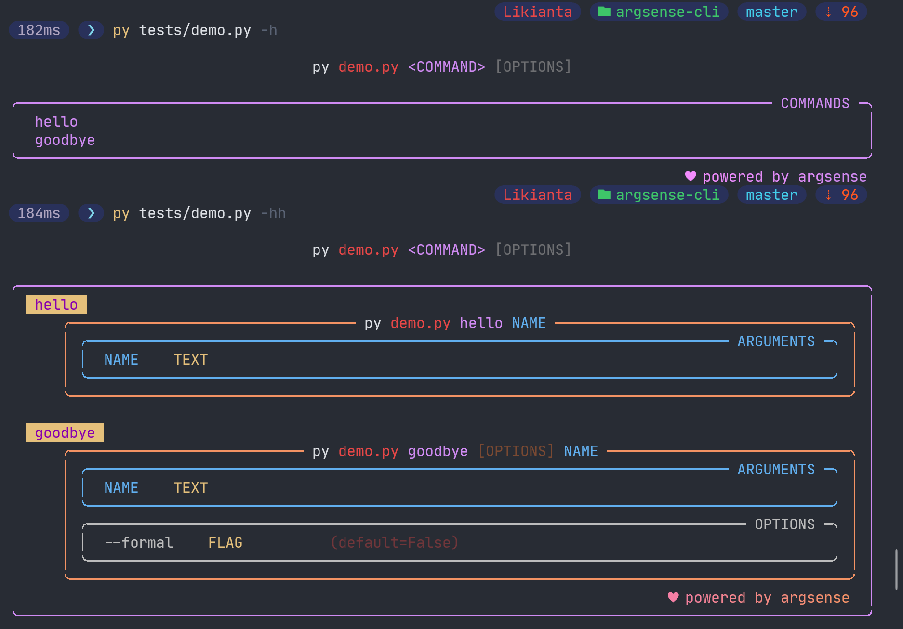
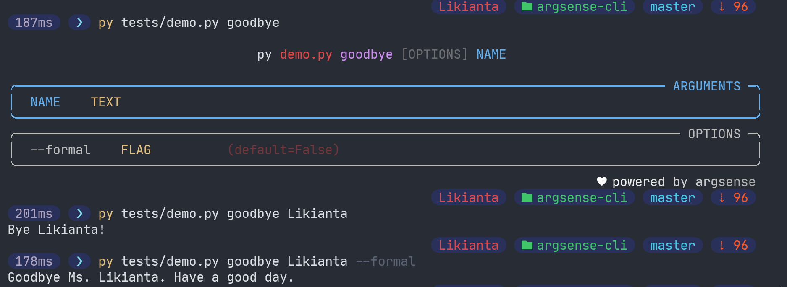
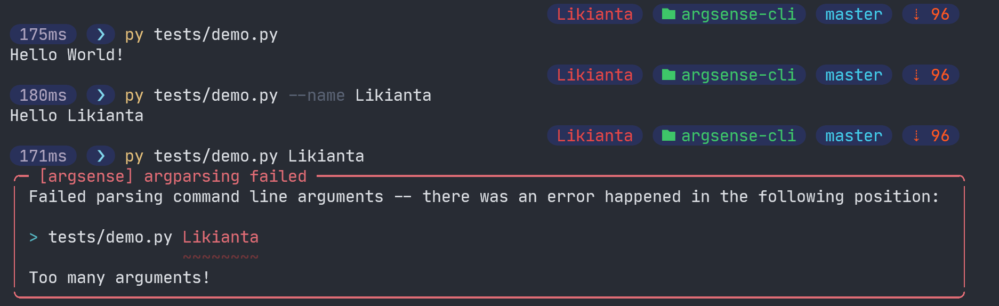
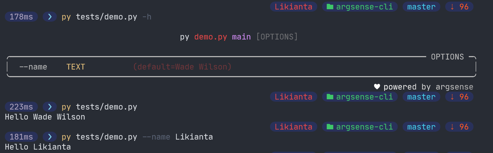
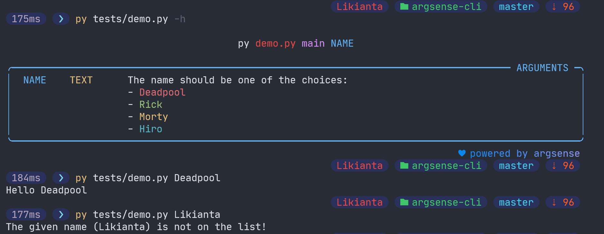
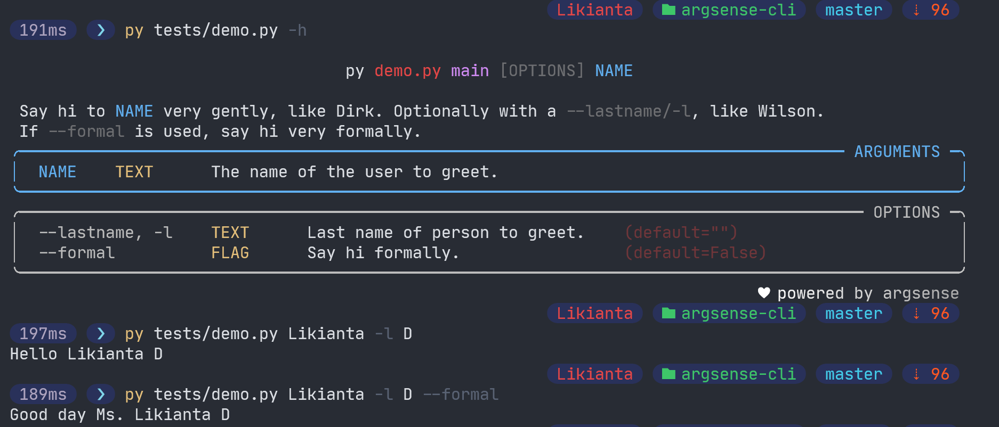
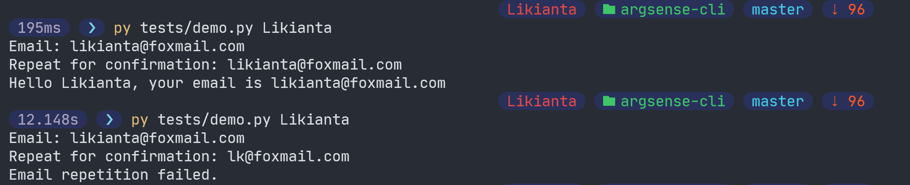

# Argsense CLI

**argsense** is a command line interface made with Python.


## Usage

> Currently this section is under construction.
> 
> Please check the folder ./examples for your reference.

## Comparison to other CLIs

> I picked several official examples from [Typer](https://typer.tiangolo.com/) project to show differences by code to code.

### Hello world

**typer**

```python
import typer

def main(name: str):
    typer.echo(f"Hello {name}")

if __name__ == "__main__":
    typer.run(main)
```

**argsense**

```python
from argsense import cli

@cli.cmd()
def main(name: str):
    print(f'Hello {name}')

if __name__ == '__main__':
    cli.run(main)
```



### Multiple subcommands

**typer**

```python
import typer

app = typer.Typer()

@app.command()
def hello(name: str):
    typer.echo(f"Hello {name}")

@app.command()
def goodbye(name: str, formal: bool = False):
    if formal:
        typer.echo(f"Goodbye Ms. {name}. Have a good day.")
    else:
        typer.echo(f"Bye {name}!")

if __name__ == "__main__":
    app()
```

**argsense**

```python
from argsense import cli

@cli.cmd()
def hello(name: str):
    print(f'Hello {name}')

@cli.cmd()
def goodbye(name: str, formal: bool = False):
    if formal:
        print(f'Goodbye Ms. {name}. Have a good day.')
    else:
        print(f'Bye {name}!')

if __name__ == '__main__':
    cli.run()
```





### Making an optional argument

**typer**

```python
import typer
from typing import Optional

def main(name: Optional[str] = typer.Argument(None)):
    if name is None:
        typer.echo("Hello World!")
    else:
        typer.echo(f"Hello {name}")

if __name__ == "__main__":
    typer.run(main)
```

**argsense**

```python
"""
Argsense (v0.3.0) doesn't have a conception of 'optional' argument, an argument 
must be required, or it is considered as an `option`.
We will bring the support in next version (v0.4.0+).
"""
from argsense import cli

@cli.cmd()
def main(name: str = None):
    if name is None:
        print('Hello World!')
    else:
        print(f'Hello {name}')

if __name__ == '__main__':
    cli.run(main)
```

*You have to use `--name` to pass the 'optional argument', otherwise it raises an error.*



### An argument with a default value

**typer**

```python
import typer

def main(name: str = typer.Argument("Wade Wilson")):
    typer.echo(f"Hello {name}")

if __name__ == "__main__":
    typer.run(main)
```

**argsense**

```python
"""
Argsense (v0.3.0) doesn't have a conception of 'optional' argument, an argument 
must be required, or it is considered as an `option`.
We will bring the support in next version (v0.4.0+).
"""
from argsense import cli

@cli.cmd()
def main(name='Wade Wilson'):
    print(f'Hello {name}')

if __name__ == '__main__':
    cli.run(main)
```



### Dynamic choices for argument

**typer**

```python
import random
import typer

def get_name():
    return random.choice(["Deadpool", "Rick", "Morty", "Hiro"])

def main(name: str = typer.Argument(get_name)):
    typer.echo(f"Hello {name}")

if __name__ == "__main__":
    typer.run(main)
```

**argsense**

```python
"""
Argsense doesn't have built in support for choices.
Here is a workaround but not so good.
"""
from argsense import cli

@cli.cmd()
def main(name: str):
    """
    args:
        name: The name should be one of the choices:
            - [red]Deadpool[/]
            - [green]Rick[/]
            - [yellow]Morty[/]
            - [cyan]Hiro[/]
    """
    if name not in ('Deadpool', 'Rick', 'Morty', 'Hiro'):
        print(f'The given name ({name}) is not on the list!')
        exit(1)
    print(f'Hello {name}')

if __name__ == '__main__':
    cli.run(main)
```



### Help information / Command description

The example shows:

- Command description.
- Long description that exceeds 80 characters one line (let's see how do we do line breaks).
- Multiple lines of description.

**typer**

```python
import typer

def main(
    name: str = typer.Argument(..., help="The name of the user to greet"),
    lastname: str = typer.Option(
        "", "--lastname",  "-l", 
        help="Last name of person to greet."
    ),
    formal: bool = typer.Option(False, help="Say hi formally."),
):
    """
    Say hi to NAME very gently, like Dirk. Optionally with a --lastname/-l, like
    Wilson.

    If --formal is used, say hi very formally.
    """
    if formal:
        typer.echo(f"Good day Ms. {name} {lastname}.")
    else:
        typer.echo(f"Hello {name} {lastname}")

if __name__ == "__main__":
    typer.run(main)
```

**argsense**

```python
from argsense import cli

@cli.cmd()
def main(name: str, lastname='', formal=False):
    """
    Say hi to [blue]NAME[/] very gently, like Dirk. Optionally with a -
    [dim]--lastname/-l[/], like Wilson.
    If [dim]--formal[/] is used, say hi very formally.

    args:
        name: The name of the user to greet.
    
    kwargs:
        lastname (-l): Last name of person to greet.
        formal: Say hi formally.
    """
    if formal:
        print(f'Good day Ms. {name} {lastname}.')
    else:
        print(f'Hello {name} {lastname}')

if __name__ == '__main__':
    cli.run(main)
```



### Confirmation Prompt

**typer**

```python
import typer

def main(
    name: str, 
    email: str = typer.Option(..., prompt=True, confirmation_prompt=True)
):
    typer.echo(f"Hello {name}, your email is {email}")

if __name__ == "__main__":
    typer.run(main)
```

**argsense**

```python
"""
Argsense doesn't have built in support for confirmation prompt.
Here is a workaround but not so good.
"""
from argsense import cli

@cli.cmd()
def main(name: str):
    email = input('Email: ')
    if input('Repeat for confirmation: ') != email:
        print('Email repetition failed.')
        exit(1)
    
    print(f'Hello {name}, your email is {email}')

if __name__ == '__main__':
    cli.run(main)
```



<!-- Template

**typer**

```python

```

**argsense**

```python

```


-->
