# Argsense CLI

[](https://badge.fury.io/py/argsense) [](https://pepy.tech/project/argsense) [](https://pepy.tech/project/argsense)

[中文版](https://blog.csdn.net/Likianta/article/details/144585120)

> DISCLAIMER: This document is mainly generated by Google Cloud Translation Service. I have proofread the text and polished some of the content. Sorry if there are any incorrect grammar or descriptions.

**Argsense** is a command line interface for python programmer.

It is simpler than argparse, click, typer, mush similar to [yapx](https://www.fresh2.dev/r/yapx/).

Screenshots:

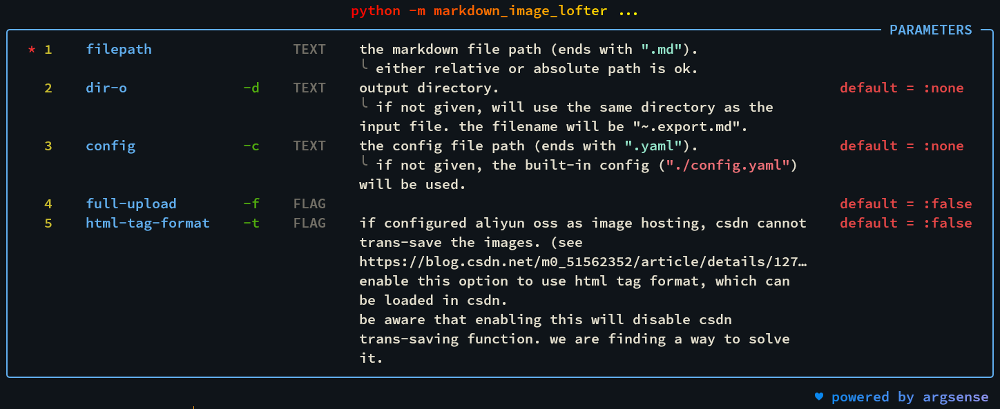

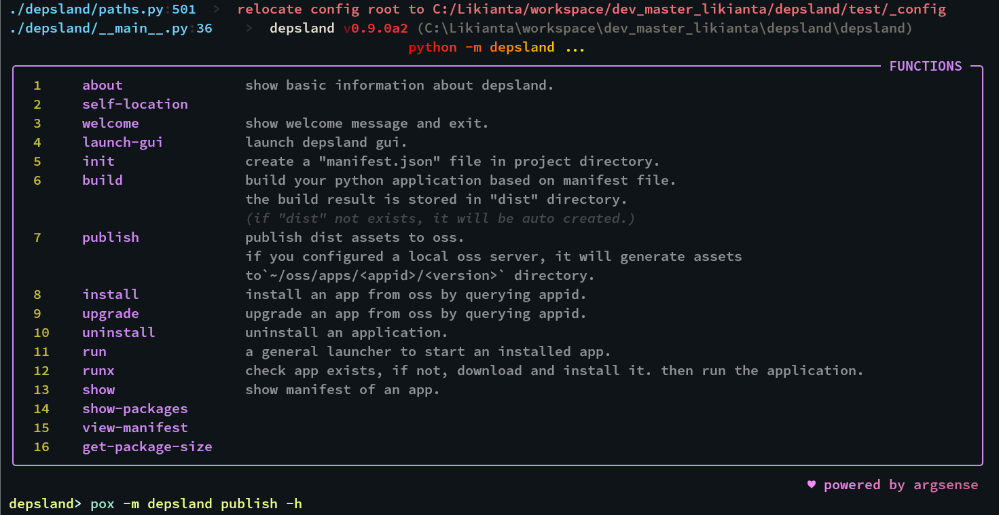

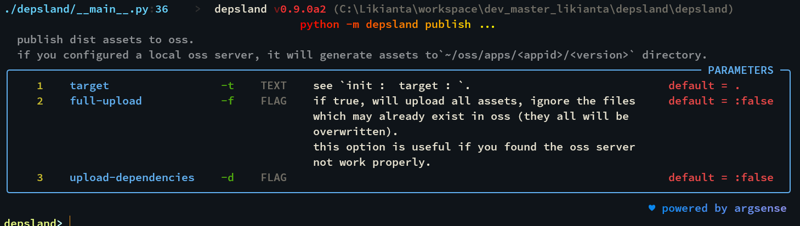

Quick glance at the code comparison:

- Using `argparse`:

  ```python
  from argparse import ArgumentParser
  
  def hello(name: str = 'world'):
      print(f'hello {name}')
  
  parser = ArgumentParser()
  parser.add_argument('--name', default='world')
  
  parsed_args = parser.parse_args()
  
  hello(name=parsed_args.name)
  ```

- Using `argsense`:

  ```python
  from argsense import cli
  
  @cli.cmd()
  def hello(name: str = 'world'):
      print(f'hello {name}')
  
  cli.run(hello)
  ```

  and it prints more beautiful help interface:

  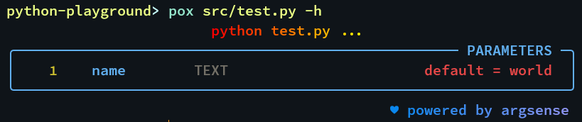

## Install

Support Python 3.8 and above:

```shell
pip install argsense
```

The latest version is 0.6.0+.

## Quick Start

> Note: some code examples use randomly generated words that have no actual meaning, they are only used to help you understand the overall code structure.

### Decorate a function

```python
# test.py
from argsense import cli

@cli.cmd()
def main(foo, bar):
    ...

if __name__ == '__main__':
    cli.run(main)
```

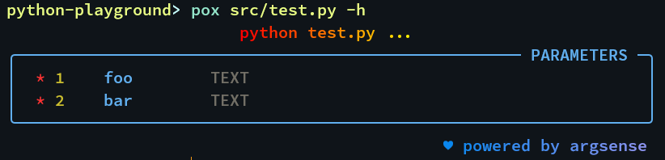

Illustrate:

- Import the `argsense` module: `from argsense import cli`.
- Use `@cli.cmd()` to decorate the target function.
- Run `cli.run(<entrance_func>)`.

### Decorate multiple functions

```python
# test.py
from argsense import cli

@cli.cmd()
def func1(foo, bar):
    ...
    
@cli.cmd()
def func2(foo, bar):
    ...

if __name__ == '__main__':
    cli.run()
```

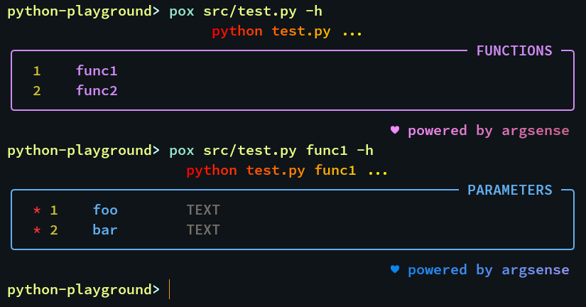

Illustrate:

- Decorate each function with `@cli.cmd()`.
- Run `cli.run()` instead of `cli.run(<entrance_func>)` so that we can pass in the specific function name in the command line.
- `python test.py -h` displays the help for all functions; `python test.py <func> -h` displays the help for a specific function.

### Help interface documentation

`argsense` parses the docstring of a function and extracts function description, parameter description and other information from it.

```python
# test.py
from argsense import cli

@cli.cmd()
def main(foo, bar):
    """
    raise face talk traditional whom population character.
    air surface affect or audience put professional.
    
    params:
        foo: line bill network road alone customer case.
        bar: avoid pass specific so president though. 
            everyone my red behavior sea.
    
    so job able far heart fund weight. family later energy -
    community beautiful other tv.
    
    reference links:
        - https://campos.com/f132eb1dbd2511efb10300155db7dfe7
        - http://woods.com/f58e8e41bd2511efae3600155db7dfe7
        - http://www.barry.com/f5de9271bd2511efa59600155db7dfe7
    """
    ...

if __name__ == '__main__':
    cli.run(main)
```

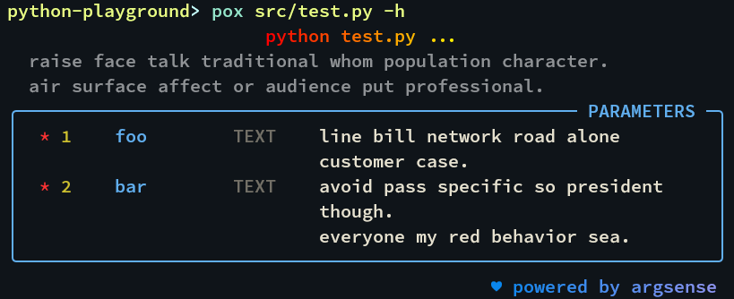

Illustrate:

- The first few lines of text will be used as function description. When other fields appear in a line, the subsequent text will not be used as function description.
- Parameter descriptions start with the "param:" field, the field name is case in-sensitive.

### Optional parameters

```python
# test.py
from argsense import cli

@cli.cmd()
def main(aaa, bbb, ccc=123, ddd='good', eee=True):
    """
    params:
        aaa: allow evening fire cup next commercial.
        bbb: develop ask decision. once start impact himself.
        ccc: prepare really there fire support outside.
            race chair statement citizen society power look husband.
            though-material:
                - ever
                - above
                - upon
        ddd (-d): wall him suddenly bag however white.
        eee (-e): 
            challenge alone without development. customer catch fund -
            hair task buy.
    """
    ...

if __name__ == '__main__':
    cli.run(main)
```

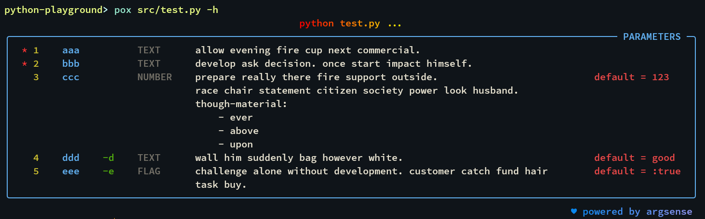

Illustrate:

- A red asterisk will be displayed on the left of the required parameter, indicating that this parameter must be given.
- `ddd (-d): ...` will be recognized as: user can use both `--ddd` and `-d` to pass this parameters.
- If the type of an argument is not specified, `argsense` will try to infer the type from its default value.
  
  Please note that only primitive types are supported, others will be treated as "any" types.
- On the right, the default values of the optional parameters are shown.

### Type of parameter

`argsense` uses type annotations to determine the type of the parameter; if there is no type annotation, it will try to infer from its default value; if none, it will be treated as "any" type.

When passing parameters, users do not need to consider type conversion. For example, when user gives `true`, if the parameter type is str, it will be translated to a string of `"true"` ; if it is bool, it will be translated to `True` .

Please note that passing wrong types will result in an error. That is, we cannot pass a string like "abcd..." to an int type parameter.

### `*args` and `**kwargs`

`argsense` supports `*args` and `**kwargs` parameter passing, and its usage is intuitive. Look the following example:

```python
# test.py
from argsense import cli

@cli.cmd()
def main(aaa, *bbb, ccc=123, **ddd) -> None:
    print(f'{aaa=}, {bbb=}, {ccc=}, {ddd=}')

if __name__ == '__main__':
    cli.run(main)
```

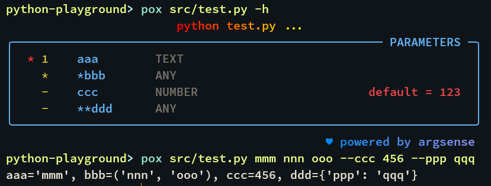

### Passing special values

`argsense` supports converting the following values to specific Python values:

| User inputs | Recognized as       |
| ----------- | ------------------- |
| `:true`     | `True`              |
| `:false`    | `False`             |
| `:none`     | `None`              |
| `:empty`    | `''` (empty string) |

**Passing boolean values**

The usage of boolean values (`:true` `:false`) is rather special. Please refer to the following examples for understanding:

```python
# test.py
from argsense import cli

@cli.cmd()
def main(foo: bool, bar: bool):
    """
    params:
        foo (-f):
        bar (-b):
    """
    ...

if __name__ == '__main__':
    cli.run(main)
```

To pass true, the following are equivalent:

```shell
python test.py :true :true
python test.py --foo --bar
python test.py -f -b
```

They will be parsed as `main(foo=True, bar=True)` .

Note that you cannot write `python test.py --foo :true --bar :true` , because `--foo` itself already means `foo=True` . This is `argsense` 's special understanding of boolean values.

To represent false, the following are equivalent:

```shell
python test.py :false :false
python test.py --no-foo --no-bar
python test.py -F -B
```

This will be parsed as `main(foo=False, bar=False)` .

Note the `-F` syntax. We require that the abbreviation in `foo (-f)` must be lowercase (otherwise `argsense` will report parsing error), so there is no mixing of uppercase and lowercase in the comment document. Uppercase is used specifically to indicate "non".

Disadvantage: Due to the above design, `argsense` cannot handle some special parameter names. For example, `def main(no_alpha: bool)` will cause `--no-alpha` to not be parsed correctly and will raise an error.

### Hidden Parameters

...

## In-Depth Reading

### The format of function's docstring

- There is no need for blank lines between multiple lines. If there are blank lines, they will be retained as is. Multiple consecutive blank lines will also be rendered as consecutive blank lines.
- If a single line of text is too long, it can be represented by a line ends with "-":
  
  ```python
  # test.py
  from argsense import cli
  
  @cli.cmd()
  def main(foo, bar):
      """
      training speak stay try me. nothing generation side trial. seven rate -
      worry not word family.
      lay prepare anything piece method now work interesting. where mission move -
      impact future. daughter remember leave. red read message talk hand.
      similar bed capital public. former east later form people lawyer. -
      operation true similar lose receive compare how film.
      
      service cold choice model finish. send ask star without huge evening.
      next black there production space treat must often. purpose course -
      actually whatever grow. take perform our billion receive food law.
      result focus property yard let both. baby mind work style.
      """
      ...
  
  if __name__ == '__main__':
      cli.run(main)
  ```
  
  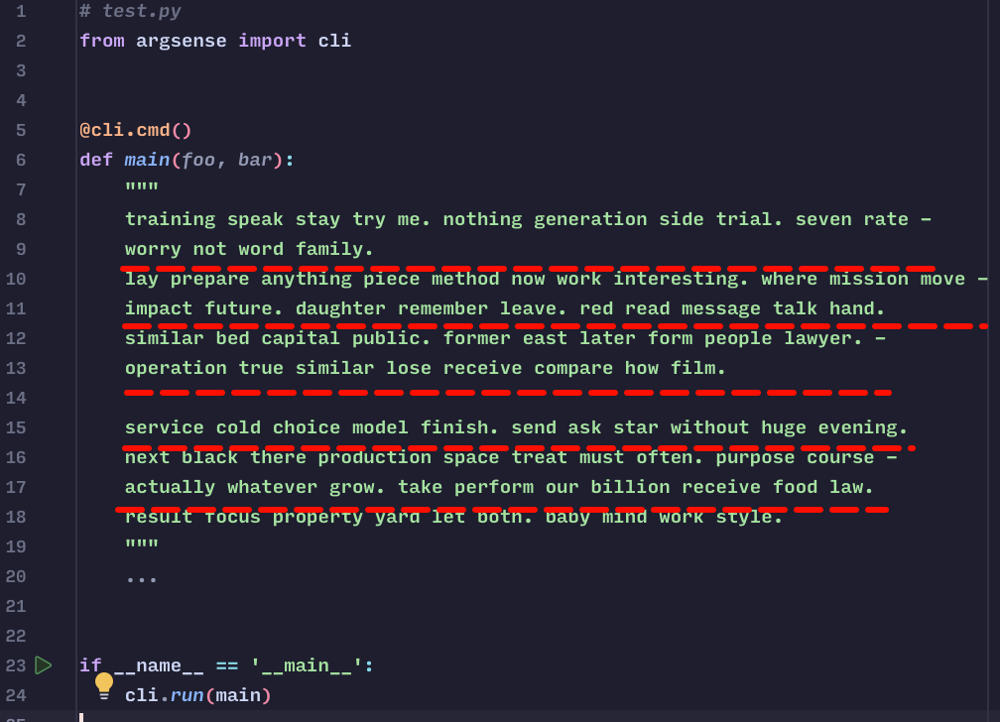
  
  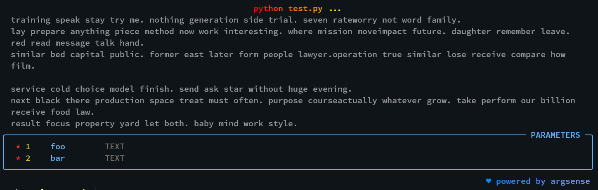
- Parameter annotations must start with the "params:" field.
- The format of parameter annotation is:
  
  ```
  <param_name> (<short_name>): <first_line_of_description>
      <more_description_lines>
  ```
  
  - `param_name` must be a parameter that appears in the function. If there is a non-existent parameter and nor `**kwargs` in the function signature, an error will be raised.
  - `short_name` must start with a hyphen, followed by **a lowercase letter** and zero or more digits, for example:
    
    ```
    # correct
    -a
    -a1
    -a123
    
    # incorrect
    -A
    -A0
    -Abc
    -ABC
    ```
  - `first_line_of_description` is optional, if the comment text is shorter, it can be written here.
    
    If you leave this field blank, you can also write it in `more_description_lines`:
    
    ```python
    def foo(...):
        """
        params:
            aaa: degree serve across recently. 
            bbb: 
                least support seem success word.
        """
    ```
    
    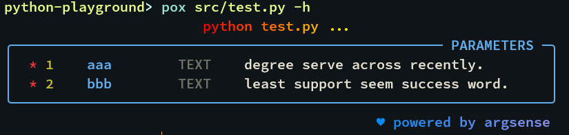
    
    Please note that if the text is long and `first_line_of_description` space is not enough, please write it in `more_description_lines` instead:
    
    ```python
    def foo(...):
        """
        params:
            aaa: degree serve across recently. 
            bbb: 
                least support seem success word.
            ccc:
                scientist do war statement pay or reflect. fill -
                get skill scene medical. side generation energy -
                but popular. ago war act nice down.
        """
    ```

### Supported parameter types

`argsense` supports a limited number of types. If an unsupported type is encountered, it is treated as "any".

The supported types are as follows:

- bool
- float
- int
- str

In addition, they can be wrapped with `typing.Optional[...]`, as shown in the following example:

```python
import typing as t
from argsense import cli

@cli.cmd()
def main(
    aaa: bool,
    bbb: float,
    ccc: int,
    ddd: str,
    eee: bool = None,
    fff: float = None,
    ggg: int = None,
    hhh: str = None,
    iii: t.Optional[bool] = None,
    jjj: t.Optional[float] = None,
    kkk: t.Optional[int] = 123,
    lll: t.Optional[str] = None,
):
    ...

if __name__ == '__main__':
    cli.run(main)
```

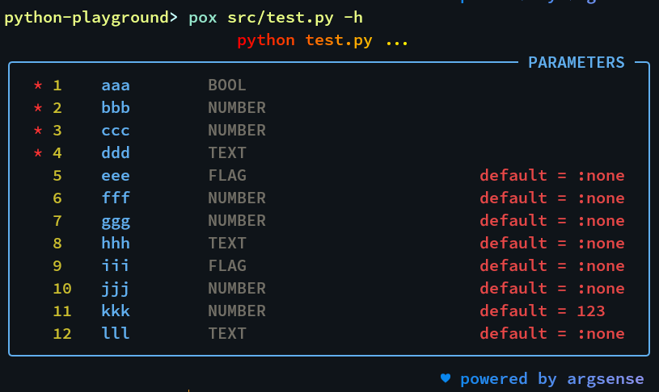

#### `bool`

Boolean values are treated as `FLAG` and their usage is rather special. Taking the above code as an example, the following usage is equivalent:

```shell
python test.py :true
python test.py --aaa
```

It will be parsed as `main(aaa=True)`.

Note that `--aaa :true` is incorrect. It will be parsed as `main(aaa=True, bbb=True)`.

To represent false, the following are equivalent:

```shell
python test.py :false
python test.py --no-aaa
```

It will be parsed as `main(aaa=False)`.

#### `int`, `float`

Both int and float are treated as `NUMBER` .

`argsense` has a flexible way of handling `NUMBER` types. You can pass a number or other number formats that conform to Python rules, such as binary "0b1010", "0b1100\_0011" and hexadecimal "0xAF2C", "0xFF36\_A2B2", etc.

They will all be parsed into corresponding int/float values.

#### `str`

...

#### `Optional[...]`

...

#### What will be if we pass a wrong type?

...

## Frequently Asked Questions

**Q: What are the advantages of ArgSense, compared to ArgParse, Click, Fire, Typer and other libraries?**

...

**Q: How to pass a complex type parameter?**

...

**Q: When there are too many functions, I want to group them. How can I do it?**

...

**Q: Why is ArgSense not designed to follow traditional command line usage?**

...
