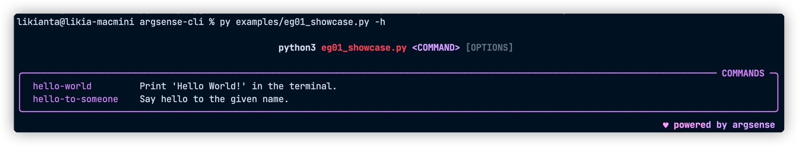
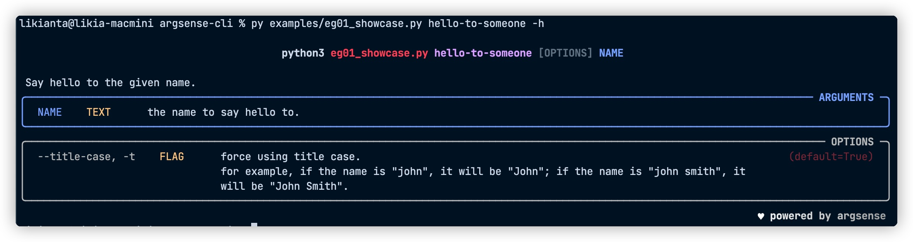

# Argsense CLI

**argsense** is a command line interface made with Python.

<!--
")

-->

## Usage

> Currently this section is under construction.

> Please check the folder ./examples for your reference.
