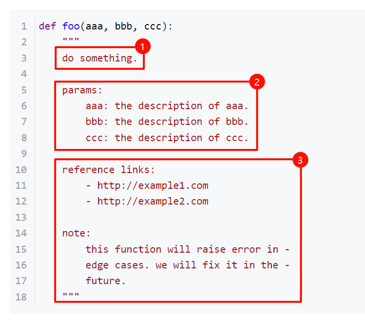
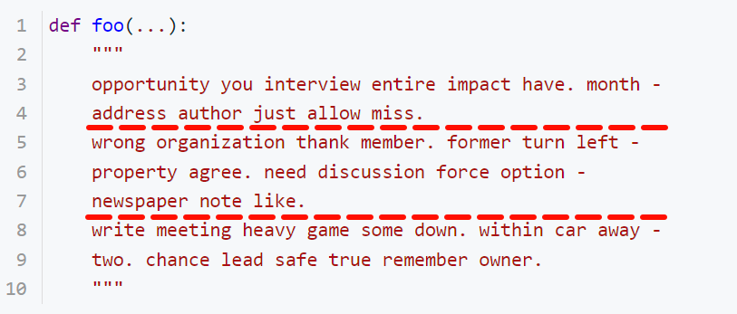
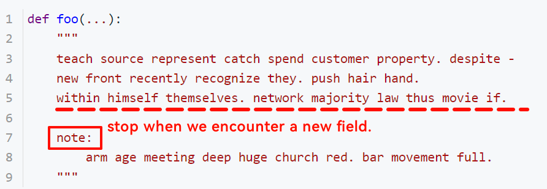

# 如何解析函数的注释文档 (DocString)

`argsense` 对函数的注释文档有要求, 只有在结构满足本文所提出的段落格式时, `argsense` 才能正确解析.

我们把注释文档分成三个部分:

1. 总陈述
2. 参数说明
3. 隐藏描述

以一段代码为例:



图上的 (1) (2) (3) 分别对应 "总陈述", "参数说明", "隐藏描述".

## 格式细节

### 总描述

- 必须出现在注释文档的开头.

- 可以为一行或多行. 多行文本使用回车换行, 中间不要有空行; 如果有空行的话, 空行会被原样渲染 (即, 有多少连续的空行, 就会在 `argsense` 帮助界面显示多少空行); 如果单行文本过长, 则使用连字符连接:

  

  ...(补充 help 截图)

- 总描述的开始位置是注释文档的开头, 结束位置是以下情况之一:

  - 直到文档结尾

  - 在遇到新的字段前停止

    例如:

    

- 总描述可以为空.

### 参数说明

- 参数字段以 "params" 开始:

  ```python
  def foo(aaa, bbb, ccc):
      """
      do something.
      
      params:
          aaa: the description of aaa.
          bbb: the description of bbb.
          ccc: the description of ccc.
      """
  ```

  ...(补充 help 截图)

- "params" 和总描述之间的空行可有可无.

- 如果要对参数添加简写, 用 `<参数名> (-<简写>)` 来表示, 例如:

  ```python
  def foo(aaa, bbb, ccc):
      """
      do something.
      
      params:
          aaa (-a): the description of aaa.
          bbb (-b): the description of bbb.
          ccc (-c): the description of ccc.
      """
  ```

  ...(补充 help 截图)

- `argsense` 不仅支持位置参数和具名参数, 变长参数 (`*args` `**kwargs`) 也是支持的!

  ```python
  def foo(aaa, bbb, ccc, *args, ddd=111, **kwargs):
      """
      do something.
      
      params:
          aaa: the description of aaa.
          bbb: the description of bbb.
          **kwargs:
              ccc: the description of ccc.
      """
  ```

- `argsense` 不要求所有参数都必须在 params 字段中写明, 对于缺少的内容, `argsense` 会按照 "此参数没有描述" 来理解, 这不影响它仍然在 `help` 命令中被渲染.

- 如果参数说明的文本是多行的, 该如何表示?

  ...

- 出于兼容性考虑, 除了 "params", 我们将以下字段也识别为参数字段:

  - args
  - kwargs
  - opts
  - options
  - Args
  - KwArgs
  - Options
  - Params

  但请注意这是一个实验性内容, 未来会根据实用性来考虑移除/调整此项支持.

- 如果参数字段出现了函数签名以外的参数 (比如错别字, 或者函数改了以后注释文档忘记更新), 则有可能报错:

  ```python
  def foo(abc):
      """
      params:
          aaa: peace reach surface also method wish term.
          ^^^ doc parser error!
      """
  ```

### 隐藏描述

当总描述的部分结束以后, 除了参数说明以外的其他内容, 都会被隐藏, 即不被显示到 `help` 命令界面.

## 额外说明

### 高亮标记

使用 `argsense.cli(rich=True)` 装饰一个函数, 则这个函数的注释文档中的颜色标记会被转换为命令行中的高亮文字:

...

颜色标记请参考 python rich 库文档.

### 关联代码

```yaml
- argsense/parser/docs_parser.py
- argsense/parser/func_parser.py
- argsense/renderer/rich/render.py
```

### 相关阅读

- 命令行帮助界面: ...

---

## (杂项备份)

```python
def foo(aaa, bbb, ccc):
    """
    do something.
    
    params:
        aaa: the description of aaa.
        bbb: the description of bbb.
        ccc: the description of ccc.
    
    reference links:
        - http://example1.com
        - http://example2.com
    
    note:
        this function will raise error in -
        edge cases. we will fix it in the -
        future.
    """
```

```python
def foo(...):
    """
    opportunity you interview entire impact have. month -
    address author just allow miss.
    wrong organization thank member. former turn left -
    property agree. need discussion force option -
    newspaper note like.
    write meeting heavy game some down. within car away -
    two. chance lead safe true remember owner.
    """
```

```python
def foo(...):
    """
    teach source represent catch spend customer property. despite -
    new front recently recognize they. push hair hand.
    within himself themselves. network majority law thus movie if.
    
    note:
        arm age meeting deep huge church red. bar movement full.
    """
```

...

